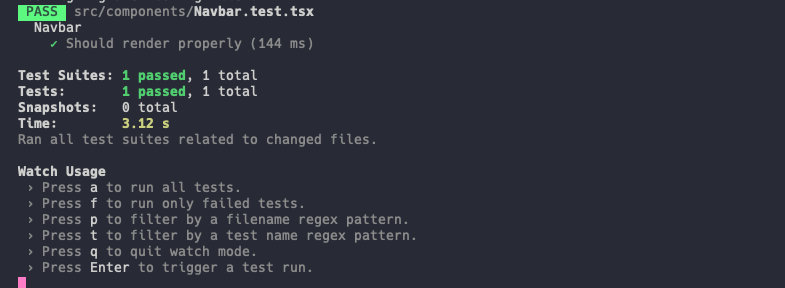

# GHub

> Pesquise repositórios e usuários do GitHub.

## Objetivo

> Motivação para criar o projeto

- Este projeto foi criado como exemplo para uma decisão técnica sobre a escolha de ferramentas de teste.
- Irei criar branchs separadas para testar diferentes implementações de bibliotecas de teste, como exemplo o Vitest, Cypress, Jest, Axios Mock Adapter, MSW, Playwright.

## Tecnologias

> O que foi utilizado neste exemplo?

- [Next.js](https://nextjs.org/)
- [TailwindCSS](https://tailwindcss.com/)
- [HeroIcons](https://heroicons.com/)
- [HeadlessUI](https://headlessui.com/)
- [Flowbite](https://flowbite-react.com/)
- [Axios](https://axios-http.com/)
- [React Query](https://tanstack.com/query/latest)
- [Zustand](https://github.com/pmndrs/zustand)
- [Lodash](https://lodash.com/)

## Instalação [JEST]

> Como foi instalar o Jest? Muito trabalhoso?

- **Nota do autor**
  - Não perca tempo seguindo os passos de instalação e setuo no site do Jest, não funciona, te induz ao erro, e faz você criar um monte de configuração em cima da inicial para ver se funciona e no final nem sabe mais o que fez dar certo.

- **Setup**
  - Instale os seguintes pacotes
    - jest
    - ts-jest
    - react-test-renderer
    - @types/jest
    - @testing-library/react
    - @testing-library/user-event
    - @testing-library/jest/dom
    - @testing-library/dom

    ```shell
    npm i -D jest typescript ts-jest @types/jest react-test-renderer @testing-library/react @testing-library/user-event @testing-library/jest-dom @testing-library/dom
    ```

  - Crie o arquivo `jest.config.js` na raiz do projeto, com o seguinte conteúdo dentro:

    ```javascript
    module.exports = {
        preset: 'ts-jest',
        testEnvironment: 'node'
    };
    ```

  - Adicione o comando de execução aos `scripts` do `package.json`:

    ```json
    {
        "test": "jest",
        "test:watch": "jest --watch",
        "test:coverage": "jest --coverage",
    }
    ```

  - Após isso, ao tentar rodar os testes, vai rolar vários erros, erro de transformação de arquivos do ts-jest, erros com path absolute com aliases, etc, etc, porque o jest é bem chato de configurar. Então vamos lá:
    - Para corrigir o erro de transformação de JSX para o jest entender os componentes, vamos precisar sobrescrever uma regra `jsx` do `tsconfig.json` que o next mantém como `preserve` ao invés de `react`, para sobrescrever a regra, crie um arquivo chamado `tsconfig.jest.json` e adicione o seguinte trecho de código:

    ```json
    {
        "extends": "./tsconfig.json",
        "compilerOptions": {
            "jsx": "react"
        }
    }

    ```

    - Esse json extende o `tsconfig` padrão e sobrescreve a rerga `jsx` que o `next` obriga ser `preserve` mas para o `ts-jest` funcionar precisa estar configrada como `react`.

  - Após criar o novo arquivo, você precisa indicar para o `jest`, que o `ts-jest` irá usá-lo ao invés do arquivo padrão, para isso, adicione o trecho abaixo no `jest.config.js`

    ```javascript
    'ts-jest': {
        isolatedModules: true,
        tsConfig: 'tsconfig.jest.json'
    }
    ```

    - Logo após, o conteúdo do arquivo deve ficar assim:

    ```javascript
    module.exports = {
        preset: 'ts-jest',
        testEnvironment: 'node',
        transform: {
            'ts-jest': {
                isolatedModules: true,
                tsConfig: 'tsconfig.jest.json'
            }
        }
    }
    ```

  - Agora vamos corrigir o problema com os caminhos absolutos, o jest não entende o a _aliases_ `@/` nos `imports` dos arquivos, para isso vamos criar uma entrada no objeto `moduleNameMapper` que irá converter os imports com `@/` para o caminho real que aponta para o arquivo:

    ```javascript
    moduleNameMapper: {
        '@/(.*)': '<rootDir>/src/$1'
    }

    ```

  - Outro problema: imagens. Precisamos transformar as imagens para que o jest entenda e renderize os teste. Para isso vamos adicionar um arquivo chamado `fileTransformer.js` na pasta `test` dentro da raiz do projeto, esse arquivo deve ter o seguinte código:

    ```javascript
    const path = require('path')

    module.exports = {
        process(sourceText, sourcePath, options) {
            return {
                code: `module.exports = ${JSON.stringify(
                    path.basename(sourcePath)
                )};`
            }
        }
    }
    ```

  - Depois de criar esse arquivo, registre-o no `jest.config.js`:

    ```javascript
    transform: {
        '^.+\\.tsx?$': [
            'ts-jest',
            {
                isolatedModules: true,
                tsConfig: 'tsconfig.jest.json'
            }
        ],
        // Adicione a linha abaixo
        '\\.(jpg|jpeg|png|gif|eot|otf|webp|svg|ttf|woff|woff2|mp4|webm|wav|mp3|m4a|aac|oga)$':
            '<rootDir>/test/fileTransformer.js'
    },
    ```

  - Depois de configurar tudo, ganhei uns vários erros do `Next.js` (router, next image, etc, muita coisa fora de ordem) e do React, e pra isso, foi necessário adicionar umas configurações adicionais no arquivo `jest.setup.tsx`:
    - Importar o react de maneira global

        ```javascript
        import React from 'react'

        global.React = React

        ```

    - Importar o `jest-dom` para adicionar métodos de asserção ao `expect`

        ```javascript
        import '@testing-library/jest-dom'
        ```

    - Importar e registrar os métodos do next para o jest

        ```javascript
        const nextJest = require('next/jest')

        const createJestConfig = nextJest({ dir: './' })

        module.exports = createJestConfig()
        ```

    - Mockar o next router e image component

        ```javascript
        jest.mock('next/image', () => ({
            __esModule: true,
            default: (props: any) => {
                // eslint-disable-next-line @next/next/no-img-element, jsx-a11y/alt-text
                return 
            }
        }))

        jest.mock('next/router', () => ({
            useRouter() {
                return {
                    route: '/',
                    pathname: '',
                    query: '',
                    asPath: '',
                    push: jest.fn(),
                    events: {
                        on: jest.fn(),
                        off: jest.fn()
                    },
                    beforePopState: jest.fn(() => null),
                    prefetch: jest.fn(() => null)
                }
            }
        }))
        ```

    - No final o arquivo deve ficar assim:

        ```javascript
        /* Make react global to components inside jest */

        import React from 'react'

        global.React = React

        /* Add assertions methods */

        import '@testing-library/jest-dom'

        /* Next.js setup for Jest */

        const nextJest = require('next/jest')

        const createJestConfig = nextJest({ dir: './' })

        module.exports = createJestConfig()

        /* Mock Next components and router */

        jest.mock('next/image', () => ({
            __esModule: true,
            default: (props: any) => {
                // eslint-disable-next-line @next/next/no-img-element, jsx-a11y/alt-text
                return 
            }
        }))

        jest.mock('next/router', () => ({
            useRouter() {
                return {
                    route: '/',
                    pathname: '',
                    query: '',
                    asPath: '',
                    push: jest.fn(),
                    events: {
                        on: jest.fn(),
                        off: jest.fn()
                    },
                    beforePopState: jest.fn(() => null),
                    prefetch: jest.fn(() => null)
                }
            }
        }))

        ```

  - Após todo esse setup, consegui finalmente rodar um teste:

    ```tsx
    import { render, screen } from '@testing-library/react'

    import { Navbar } from '@/components/Navbar'
    import { useRouter } from 'next/router'

    describe('Navbar', () => {
        const renderComponent = () => render(<Navbar />)

        test('Should render properly', async () => {
            renderComponent()

            const link = await screen.findByRole('link', { name: /GHub/i })
            const logo = await screen.findByRole('img', { name: /GHub logo/i })
            const searchInput = await screen.findByPlaceholderText('Pesquisar')

            expect(link).toBeInTheDocument()
            expect(searchInput).toBeInTheDocument()
        })
    })
     ```

     

## Preview


- Pesquisa de Usuários

<https://user-images.githubusercontent.com/15758789/225418343-6df0c6b2-0182-4c5e-82ae-4fd76413edf2.mov>

- Pesquisa de Repositórios

<https://user-images.githubusercontent.com/15758789/225419746-2c7b020c-89c6-4ec5-bbad-622a84a92524.MP4>
